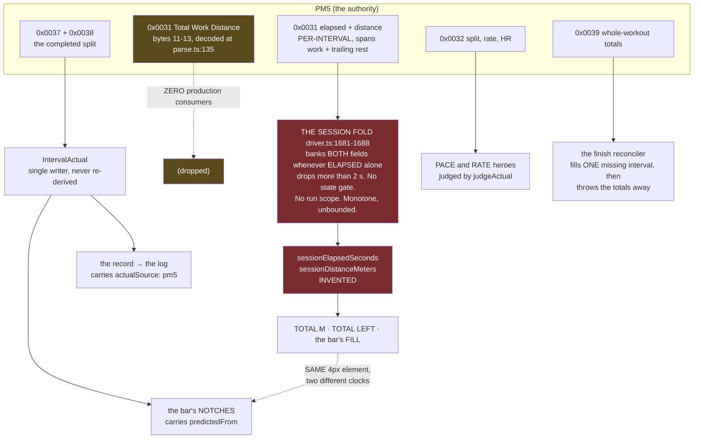

# Architecture review: the connected rower's state system

**Subject.** The whole connected (PM5) pipeline, from a BLE packet to a pixel,
plus what it writes down: `app/src/monitor/transports/`, `app/domain/monitor/`,
`app/src/monitor/driver.ts`, `app/src/monitor/useMonitorSession.ts`,
`app/src/workout/connected/surfaceModel.ts` and its panes,
`app/src/monitor/monitorRun.ts`, `app/src/session/logDraft.ts`.

**Date.** 2026-08-13. **Tree.** `state-review` worktree at `fca774f`.
**Status.** A review of a design, not of a diff. It changes no code.

**How to read this.** Section 1 is the map you need before anything else makes
sense. Section 2 says which of the founding assumptions survived. Section 3 is
the answer to "what is actually wrong". Sections 4 and 5 judge the design
against outside practice and against the work already planned. Section 6 is
roadmap input. Sections 7 and 8 are the review auditing itself: where its own
contributors contradicted each other, and what nobody could establish.

**Method, and why it is stated up front.** This system was built across seven
phases with four hardware walks, and its comments are unusually detailed. They
are also, repeatedly, wrong: on 2026-08-13 three separate comments claimed a fix
had cured a device defect that only ever existed in our own test harness. So
every claim below is labelled **PROVEN** (a line read, or a command run with its
output) or **INFERRED** (reasoned, with the reasoning shown), and prose in the
codebase is treated as testimony rather than fact. This document is a synthesis
of twelve independent reports (six layer maps, four lenses, two forward stress
tests). Where two of them reached the same conclusion by different routes, that
is said, because it is the strongest evidence here. Where they contradicted each
other, section 7 adjudicates with fresh verification rather than averaging.

---

## 0. Executive summary

The connected pipeline is better engineered than its defect list suggests. The
record has a single writer and a single source and refuses to be re-derived; the
program is verified by reading the machine's own state back rather than by
trusting an acknowledgement; judgement is concentrated behind one function and
that has held for seven phases; the view layer derives everything and stores
nothing. Those are not consolations, they are load-bearing decisions that any
rework must carry forward intact.

The four defects handed to this review share one structural cause, and it is not
"the code is sloppy":

> **Nothing in this pipeline can represent "this is not a measurement."**
> Not for a value, and not for a state. A number the PM5 measured, a number the
> phone programmed, and a number the driver invented all arrive as bare
> `number`s on one object, are formatted by the same helpers, and are painted
> with the same authority. A machine state we have no display for is coerced by
> `?? "live"` into one we do. A fact about the rower with no axis of its own is
> written into the slot that holds the session's lifecycle. A program that came
> out of `localStorage` two deploys ago has the same type as one compiled 200 ms
> ago. In every case the unknown, the not-yet and the invented are coerced into
> the nearest legal value, and the result renders as a plausible screen.

That is why every gate this repo owns passed while the app reported 16938 m
against the erg's own 4384 m. The characteristic failure of this architecture is
not a crash. It is a confident wrong number, in the right units, in the right
place, in the right font. No check that compares the app against itself can
distinguish that from correct, which is exactly what `CLAUDE.md`'s recurring
failure #11 says.

Underneath that shared cause sits one mechanism that is separately and simply
wrong: **the session total is an edge-triggered accumulator standing in for a
level-triggered read.** Three contributors reproduced it independently, two of
them through the real `createPm5Driver`, and all three got the same number: a
23.9 m piece reports 47.8 m, exactly 2.00x, from one terminate and re-arm, with
no hardware attached and using a capture committed to this repo since
2026-08-07.

Two things follow for planning. First, the cheapest useful change in the whole
review is two more values interpolated into a log line the driver already
writes: it would have turned "Sun fret" into a log entry on walk 5 without a
camera. Second, **fixing the authority of the session total is a prerequisite
for the parked reconnect work, not a parallel item**, because a fold cannot
survive a gap by construction and a reading is correct on the first frame after
one.

No rewrite is warranted. Section 6 argues that with a migration path.

---

## 1. The map

### 1.1 The pipeline as it is

```
PM5  0x0031 general status (~2 Hz)  ·  0x0032 additional 1  ·  0x0033 additional 2
     0x0037 + 0x0038 split/interval  ·  0x0039 + 0x003A end-of-workout summary
      │
      ▼
src/monitor/transports/{webBluetooth,capacitorBle,fake}.ts
      moves bytes; interprets no value; cannot answer "am I connected?"
      ▼
domain/monitor/pm5/parse.ts        pure codec, no memory
      decodes 48 fields across five characteristics; 31 of them have no
      production consumer at all
      ▼
src/monitor/driver.ts   (3740 lines, one closure, ~30 mutable slots)
      five machines that share no vocabulary: the run · the programming
      lifecycle · the boundary pairing gate · the end-of-run reconciler ·
      THE SESSION FOLD
      ▼
src/monitor/useMonitorSession.ts   (1427 lines)
      7 state fields + 11 refs + 14 patch sites; ConnectedPhase (10 values)
      ▼
src/workout/ConnectedInterstitial.tsx → ConnectedSurface.tsx
      ▼
src/workout/connected/surfaceModel.ts   pure, 26 display fields, ONE call site
      ▼
PaneLive · PaneGrid · ConnectionLine        place strings, no arithmetic

and, off to one side and fed separately:
useMonitorSession → monitorRun.ts → localStorage "ergomatic.monitorRun"
                                  → LogSession → logDraft.ts → the log
```

Two properties of that picture matter more than any individual box.

**The stages that can be re-run on a value are the stages that only format.**
The codec, the surface model, the panes and the log builder are pure functions
of their inputs. The driver and the hook are not, and every invented number in
the system is born in one of those two. You cannot ask the driver "what would
you have concluded from these frames?" without constructing a transport, and you
cannot ask the hook "what phase does this event sequence produce?" without
rendering a component.

**The persisted half is more honest about provenance than the live half.**
`LogStep.actualSource: "pm5"` (`logDraft.ts:149`) records where a logged number
came from, and `buildMonitorLogSteps` refuses to infer an actual the machine did
not measure, because "the PM5, not this app's clock, is the only witness"
(`logDraft.ts:713-717`). `IntervalBoundaries.predictedFrom`
(`intervalBoundaries.ts:227`) marks which notch on the progress bar is measured
and which is estimated. Both patterns work. Neither exists on the live path.

### 1.2 The real machine

This is not the idealised phase diagram. It is what the code actually holds,
including the states that have no name, the counters nobody can read, and the
transitions that are reachable and wrong.

```mermaid
stateDiagram-v2
    direction TB
    [*] --> idle
    idle --> picking : connect()
    picking --> pairing : device chosen
    picking --> failed : scan-dismissed / bluetooth-off / transport-missing
    pairing --> failed : link-failed
    pairing --> programming : program() [OPTIMISTIC, sync, before any await]
    programming --> failed : 8 typed rejections
    failed --> programming : Try again (device known)
    failed --> picking : Try again (no device)

    programming --> ready : armed event, only after verifyArmed reads the<br/>machine's own structure back

    state ready {
        [*] --> interstitial
        interstitial --> numbers_shown : rower taps SHOW ME THE NUMBERS
    }
    note right of ready
        numbers_shown IS NOT A PHASE. It is
        React state (numbersRequested,
        ConnectedInterstitial.tsx:199).
        The phase is still "ready", and
        surfaceStatusFor(ready) returns null,
        laundered to "live" by ?? at
        surfaceModel.ts:409.   DEFECT 2
    end note

    ready --> live : frame.state=rowing AND rowingActive AND distance>0
    ready --> live : FALLBACK after 5 strictly increasing rowing frames<br/>(overrules the machine's own Rowing State byte)

    state live {
        [*] --> moving
        moving --> counting : 3 metrics byte-identical
        counting --> counting : still identical (frames 2, 3)
        counting --> moving : any of distance / split / spm moves
    }
    note right of live
        The freeze counter 0..3 is a ref
        (freezeRef). No consumer can read it.
        Inside "live" the machine may be
        rowing OR resting; there is no
        phase for a rest.
    end note

    live --> paused : 4th identical frame
    paused --> live : any metric moves
    note left of paused
        DERIVED. There is no paused state on
        the wire. The machine still reads
        "rowing" and its interval clock keeps
        draining the whole time the word is on
        screen.   DEFECT 3
    end note

    live --> ended : workoutComplete / terminated / End
    paused --> ended : same
    live --> disconnected : transport announces a drop
    paused --> disconnected : transport announces a drop
    disconnected --> ended : End

    state ended {
        [*] --> handoff_held : machine finish left the<br/>last actual missing
        handoff_held --> released : final boundary, or the 3500 ms backstop
    }
    note right of ended
        Concurrently, INSIDE THE DRIVER and
        invisible here: a 3000 ms finish grace
        and a summary reconcile timer. The
        strict inequality 3000 < 3500 is what
        keeps the fill on a mounted screen,
        and it is enforced by a comment in
        two files.
    end note

    released --> [*] : onEnded navigates

    disconnected --> disconnected : ‼ frames keep arriving and keep<br/>updating, labelled LAST, forever
    failed --> disconnected : ‼ error is NOT cleared; the failure card<br/>vanishes and the live surface renders
    live --> live : ‼ a silently dead link is indistinguishable<br/>from a rower holding steady. No watchdog exists
```



Six axes decide "what is happening now" and only one of them is `ConnectedPhase`:

| Axis                                                                         | Where it lives                   | Visible to a consumer?               |
| ---------------------------------------------------------------------------- | -------------------------------- | ------------------------------------ |
| `phase` (10 values)                                                          | `useMonitorSession.ts:85-95`     | yes                                  |
| `frame.state` (6 wire values: idle/armed/rowing/resting/finished/terminated) | `domain/monitor/types.ts:104`    | yes, but never composed with `phase` |
| `numbersRequested`                                                           | `ConnectedInterstitial.tsx:199`  | no, component state                  |
| the freeze run 0..3                                                          | `useMonitorSession.ts:735`       | no, a ref                            |
| `runRef` null / open / closed                                                | `useMonitorSession.ts:730`       | no, a ref                            |
| the driver's `activeRun`, finish grace, `boundaryHalves`, session fold       | `driver.ts:904, 990, 1151, 1089` | no, a closure                        |

Counted as state variables that can vary independently and change behaviour,
there are **25**, of which **17 are unreadable** by any component
(lens-statechart §3.1). A minimal honest region product (link 5 x program 4 x
session 3 x rower 3) is 180 configurations. `ConnectedPhase` has ten names for
it. The encoding is lossy by construction, so every fact it cannot carry has to
leave the type by another door, and those seventeen refs are the doors.

Taking only four fields of `SessionState` (`phase` x `error` x `endedBy` x
`handoffHeld`) there are 900 representable configurations and roughly 25
intended. At least three of the illegal ones are reachable today, and the
important thing about all of them is in the diagram's three `‼` edges: **the
system never fails loudly.** Every illegal configuration produces a plausible
screen.

### 1.3 The data path, and where invention enters

This second diagram earns its place because provenance is the headline finding.
Every arrow that is not "wire" is a place where we decide something, and only
two of them are marked anywhere in the code.



The dashed link between `TOTAL M` and the notches is James's symptom B, drawn
literally: `TimerRuler.tsx:14-17` computes the bar's fill from the invented
accumulator and `:60-67` places the notches from the machine's own actuals.
**Two clocks in one 4 px element.** During the first rest the fill reached 100%
while the notches stayed where they belonged.

And the sharpest single fact in this diagram: `buildSurfaceModel` receives
`frame.sessionDistanceMeters` and `input.actuals` **in the same argument
object**, renders the first as `TOTAL M` (`surfaceModel.ts:468-474`) and sums
the second three lines later for the notch bar (`:558`). The second opinion was
in hand at the call site for the entire life of the defect, and nothing in the
pipeline compares them (PROVEN: `grep -rn "sessionDistanceMeters" src domain`
returns producers and consumers and no comparison).

---

## 2. Assumptions ledger

Reconstructed from the dated record only: `docs/superpowers/specs/` phases
7A-7D and the connected revamp, `docs/design/handoffs/`,
`docs/monitor/pm5-interface-notes.md`, `docs/design/DEVIATIONS.md`, and
`ROADMAP.md`. Each is stated as a proposition that could be false. The **status**
column is this review's verdict, which the source ledger deliberately withheld.

Status key: **HELD** the design still works this way and it is right ·
**ABANDONED** the code stopped doing this, whether or not anyone said so ·
**NEVER TRUE** it was false when written · **HELD BUT UNENFORCED** the rule is
correct and the only thing keeping it is a comment.

### A. Authority: who owns a number

| #   | Proposition                                                                                     | Origin (dated)                                                                                        | Status                                   | Evidence                                                                                                                                                                                                                               |
| --- | ----------------------------------------------------------------------------------------------- | ----------------------------------------------------------------------------------------------------- | ---------------------------------------- | -------------------------------------------------------------------------------------------------------------------------------------------------------------------------------------------------------------------------------------- |
| A1  | The monitor is the single source of truth for progress; we never re-derive a number we can read | handoff README:21-24 and packet:39-41, 2026-08-05; restated as law in the 7B spec:174-176, 2026-08-07 | **ABANDONED**, quietly, on 2026-08-08    | The fold at `driver.ts:1681-1700` invents the session pair one day after the spec forbade "nothing re-derived from bytes". Nothing in the shape marks the crossing                                                                     |
| A2  | Every session-level number the rower needs is readable from the wire                            | implicit in A1                                                                                        | **TRUE, and we act as if it were false** | `totalWorkDistanceMeters` is decoded at `parse.ts:135` and has zero production consumers (PROVEN by grep). The only writer is the fake                                                                                                 |
| A3  | Where the phone must invent, the invention is confined to the driver and labelled an estimate   | commit `427f94a`, 2026-08-08                                                                          | **HALF-HELD**                            | Confined: yes, `monitorRun.ts` and `logDraft.ts` never touch `session*`. Labelled: only in a comment. `surfaceModel.ts:468-474` puts it through `judgedValue`, so the invented number acquires the full apparatus of a vouched reading |
| A4  | The phone contributes only meaning and session context, never a competing reading               | README:21-24, 2026-08-05                                                                              | **ABANDONED**                            | Three phone-computed figures now sit beside machine numbers: TOTAL M, TOTAL LEFT, and the bar's fill                                                                                                                                   |
| A5  | "Let the erg drive" governs even states the erg has and we do not display                       | James, `ROADMAP.md:2013-2017`, 2026-08-13                                                             | **RESTATED, NOT YET OPERATIVE**          | It is A1 again, eight days later, prompted by a defect. That it needed restating is the evidence A1 had stopped being operative                                                                                                        |

### B. The wire model

| #   | Proposition                                                                                | Origin (dated)                                                                     | Status                                                                        | Evidence                                                                                                                                                                                                                                                                               |
| --- | ------------------------------------------------------------------------------------------ | ---------------------------------------------------------------------------------- | ----------------------------------------------------------------------------- | -------------------------------------------------------------------------------------------------------------------------------------------------------------------------------------------------------------------------------------------------------------------------------------- |
| B1  | There is no paused state on the wire; the clock runs whether or not the rower pulls        | 7A domain design:105-113, 2026-08-05                                               | **HELD**                                                                      | `types.ts:104` still has no `paused` member. Corroborated this session: during a programmed 30 s rest the clock ran 60.42 to 91.31 s (PROVEN, §7.5)                                                                                                                                    |
| B2  | Pausing on the erg pauses the display                                                      | incoming packet:41, 2026-08-05                                                     | **NEVER TRUE**, and contradicted by B1 on the same day                        | The UI was built on a derived substitute anyway. This is the oldest unresolved contradiction in the system and it is defect 3                                                                                                                                                          |
| B3  | An ack means the program landed                                                            | 7A `program()` design, 2026-08-05                                                  | **NEVER TRUE**, and its replacement is the best thing in the system           | `verifyArmed` requires the machine's own state plus a structural readback, stable across a tick streak and a 2000 ms window (`driver.ts:2815-2819`)                                                                                                                                    |
| B6  | An interval index means the same thing on both sides of the wire                           | `MonitorFrame.intervalIndex`, 2026-08-05                                           | **NEVER TRUE**; the domain's answer is right and is undone one layer up       | Two normalisers under two rules (`intervalIndex.ts:162`, `:274`), `null` when unexplainable, with the prohibition shouted at `types.ts:133-135`. Then `surfaceModel.ts:419` does `frame.intervalIndex ?? 0` and `NO_FRAME` (`:195-208`) sets `intervalIndex: 0` while `state: "armed"` |
| B7  | 0x0031's Elapsed and Distance are session totals                                           | field names, two consumers, to 2026-08-08                                          | **NEVER TRUE**                                                                | Walk 4. The falsification of B7 is the direct origin of defect 1                                                                                                                                                                                                                       |
| B8  | Each interval's 0x0031 count spans its own work plus its trailing rest                     | §20 item 12, 2026-08-08; flagged unsettled by our own ecosystem review, 2026-08-11 | **HELD, and now PROVEN**                                                      | `pm5-session3-final.log:180-238`: through a 30 s rest the clock ran 60.42 to 91.31 and distance rose 184.9 to 261.0 m. Our machine does not stop the clock in a planned rest, so the documented ORM divergence does not apply to it (§7.5)                                             |
| B10 | The PM5 is authoritative across a link gap; reconnect re-derives position from the machine | 7A design:186-195, 2026-08-05                                                      | **NEVER BUILT**, and the fold made it unbuildable for the number that matters | You cannot re-derive a fold. There is nothing to read it back from                                                                                                                                                                                                                     |
| B11 | The end-of-workout split always arrives                                                    | run-close design, 2026-08-05                                                       | **NEVER TRUE**; reversed in three stages with hardware                        | Late by 1 ms, then late past the next tick, then droppable entirely. The grace plus the 0x0039 fallback is the right answer to all three                                                                                                                                               |

### C. The phase machine

| #   | Proposition                                                                                    | Origin (dated)                          | Status                                                                   | Evidence                                                                                                                                                        |
| --- | ---------------------------------------------------------------------------------------------- | --------------------------------------- | ------------------------------------------------------------------------ | --------------------------------------------------------------------------------------------------------------------------------------------------------------- |
| C1  | A phase is a mode the UI is in, and every phase transition maps to a real event or frame field | 7B spec:100-108, 2026-08-07             | **HELD forward, FALSE backward**                                         | Every transition does map to an event. But a phase can exist that the display has no state for, and the default for such a phase is to be laundered into `live` |
| C2  | PAUSED is a state we can derive from the frame stream                                          | 7B spec:119-130, 2026-08-07             | **PREDICATE HELD, CONCEPT ABANDONED**                                    | Replayed against the captures the predicate fires on 15 real episodes with no false positive at a changeover. It is a correct function in the wrong slot        |
| C3  | The freeze signature generalises beyond a timed piece                                          | 7B spec caveats, 2026-08-07             | **HELD**; the ROADMAP's "distance intervals are UNWATCHED" can be struck | Session 4b lines 5526-5532 and 5551-5575 are freeze episodes on intervals whose `intervalRemaining.kind` is `"distance"`                                        |
| C5  | Reconnect is a state the design carries                                                        | design README:230-241, 2026-08-05       | **NEVER BUILT**; descoped 2026-08-07 and still open                      | `MonitorEvent`'s `reconnected` member is production-unreachable; 15 tests exercise a recovery the product cannot perform                                        |
| C7  | Nothing in the connected flow runs on a wall clock                                             | stated three times, 2026-08-05 to 08-08 | **ABANDONED**                                                            | Clock ownership is now split across three layers: a driver deadline (`FINISH_GRACE_MS`), a hook hold (`FINISH_HANDOFF_HOLD_MS`), and the machine's own cadence  |

### D. Runs, records, persistence

| #   | Proposition                                                       | Origin (dated)            | Status                                                    | Evidence                                                                                                                                    |
| --- | ----------------------------------------------------------------- | ------------------------- | --------------------------------------------------------- | ------------------------------------------------------------------------------------------------------------------------------------------- |
| D1  | A run is opened by `program()` and only by `program()`            | fix-2 §4, 2026-08-06      | **HELD**, and it is the model the fold should have copied | One assignment site, `driver.ts:3686`. A deliberate refusal to let the machine's own Terminate/Rearm housekeeping fabricate our state       |
| D2  | Once `completedAt` is stamped the record is immutable             | 7B decisions, 2026-08-07  | **ABANDONED twice, correctly**                            | One vouched late write, then the summary-synthesized boundary through the same door                                                         |
| D5  | A stored record's `v` is bumped whenever the stored shape changes | 7C spec:37-38, 2026-08-08 | **ABANDONED silently**                                    | Defect 4. `ProgramInterval.type` became required with no bump; `isMonitorRun` validates the program with `Array.isArray` and nothing deeper |
| D6  | An actual that cannot be attributed is dropped, never guessed     | 7C spec §3, 2026-08-08    | **HELD**                                                  | And its cost is honest: a dropped actual is indistinguishable from an interval never reached                                                |

### E. Judgement and display

| #   | Proposition                                                          | Origin (dated)                    | Status                                                    | Evidence                                                                                                                                                                                                |
| --- | -------------------------------------------------------------------- | --------------------------------- | --------------------------------------------------------- | ------------------------------------------------------------------------------------------------------------------------------------------------------------------------------------------------------- |
| E1  | One helper decides the verdict; no pane implements its own judgement | design README:131-137, 2026-08-05 | **HELD**, and it is the strongest discipline in the layer | `judgedValue` is the only caller of `judgeActual` in `src/` (PROVEN by grep), programmed cells carry `judged: null` and are structurally untintable, and a census test counts the judged cells per pane |
| E3  | Every live actual has a target to be judged against                  | implicit, 2026-08-05              | **NEVER TRUE**                                            | Every rest phase has no target. Fixed for the rest case in the revamp; the unmodelled-state version is still open and is defect 2                                                                       |
| E6  | `intervalRemaining` is displayed, not computed                       | 7B spec:180-181, 2026-08-07       | **A WORDING TRAP**                                        | 7A had defined the same field as computed by the driver. "Displayed, not computed" means the surface does not recompute it. A reader who takes A1 literally reads it as "the machine sent this"         |

### F. How we know things

| #   | Proposition                                                                       | Origin (dated)                                                                                 | Status                                   | Evidence                                                                                                                                                                                                                                                                                                                                                                                                                          |
| --- | --------------------------------------------------------------------------------- | ---------------------------------------------------------------------------------------------- | ---------------------------------------- | --------------------------------------------------------------------------------------------------------------------------------------------------------------------------------------------------------------------------------------------------------------------------------------------------------------------------------------------------------------------------------------------------------------------------------- |
| F1  | The fake models the machine, so a green suite is evidence about hardware          | 7A fix decisions, 2026-08-05                                                                   | **NEVER TRUE in the states that matter** | Four counts, each independently proven: the armed state is zeroed where hardware carries the previous piece's readings; `totalWorkDistanceMeters` is set to the per-interval distance (`fake.ts:645`); the wire model is cumulative where hardware is per-interval, so the fold's bank branch never fires in a fake-driven test at all; and `completeReconnect()` replays a boundary that a real GATT link would never re-deliver |
| F2  | An exit criterion met against the fake transport is met                           | ROADMAP 7B/7C, 2026-08-08                                                                      | **NEVER TRUE**; now a standing rule      | `CLAUDE.md` recurring failure #11                                                                                                                                                                                                                                                                                                                                                                                                 |
| F4  | The prose in this repo records the current state                                  | house rule                                                                                     | **ABANDONED**                            | Fourteen stale or false claims found across the twelve reports, several of them load-bearing risk arguments                                                                                                                                                                                                                                                                                                                       |
| X1  | A `WorkoutProgram` is an in-memory IR, so adding a required field is compile-safe | never written down; inferred from the revamp spec discussing `ProgramInterval` only as IR      | **NEVER TRUE**                           | It crosses `localStorage`. Nothing in the record shows anyone asking whether the type crossed a persistence boundary at the moment the field was added                                                                                                                                                                                                                                                                            |
| X2  | The elapsed clock is monotone enough that a drop means a boundary                 | never written; the fold's single `>` test                                                      | **NEVER TRUE**                           | A terminate re-bases elapsed backwards to a smaller non-zero value while distance stands still. Six instances in the committed captures                                                                                                                                                                                                                                                                                           |
| X4  | `ConnectedPhase` is the only variable in "what is happening now"                  | never written; the phase union was designed once and every later mechanism was added beside it | **NEVER TRUE**                           | 25 variables, 17 hidden                                                                                                                                                                                                                                                                                                                                                                                                           |
| X5  | A number the machine reports is safe to display the moment it arrives             | never written                                                                                  | **NEVER TRUE**                           | There is no notion of "this reading is not yet meaningful" anywhere in the seam. This is the shared cause in §0                                                                                                                                                                                                                                                                                                                   |

**Two patterns in the reversals, worth naming for whoever plans the next phase.**
Every entry in families A, B7-B11 and C7 is one of exactly two questions: _who
owns this number_ and _what time is it_. And four of the reversals were caused by
our own instrument rather than by the machine: a parse bug, the fake, a
wire-log stash that proved ordering rather than delivery, and comments.

---

## 3. Findings, ranked by consequence

### F1. Four defects, one shape: the type cannot say "not a measurement"

This is the headline and it is the reason the review exists. Stated once, then
traced through each defect.

- **Defect 1 (totals).** The fold invents a number and it enters `MonitorFrame`
  as an ordinary `number`. The surface renders it under `TOTAL M`, runs it
  through `judgedValue`, and drives the progress bar with it, while holding the
  machine's own per-interval actuals in the same call. Its own doc comment calls
  it "A DISPLAY ESTIMATE, never a record" (`types.ts:44-52`) and that honesty
  reaches no consumer, no type and no pixel.
- **Defect 2 (LIVE while ARMED).** Two halves, one cause. `surfaceStatusFor`
  performs a real narrowing and returns `null` as evidence of failure, with a
  comment saying it does so "rather than guessing a state"
  (`surfaceModel.ts:101-104`). Four lines later its only caller throws the
  evidence away: `?? "live"` (`:409`). And a pre-stroke `spm: 0` is not a
  measurement, but the domain has no sentinel for it and `judgeActual` escapes
  only on `null` (`judge.ts:128-129`), so zero is compared against a target and
  painted red.
- **Defect 3 (PAUSED).** Rower-stillness is a real fact with no axis to live on,
  so it is written into `ConnectedPhase`, where it _displaces_ `live`. The model
  therefore cannot say the true thing, which is "running, and the rower is
  still, and the interval is still draining."
- **Defect 4 (unversioned persisted shape).** A program deserialised from
  `localStorage` two deploys ago and one compiled 200 ms ago have the same type.
  "This value came out of storage and may be stale" is unrepresentable.

The convergence is what makes this trustworthy: the surface map reached it from
a provenance audit of 26 display fields, the distributed lens reached it from
OPC UA's `DataValue` quality codes and Helland's memories/guesses/apologies, the
frontend lens reached it from "Parse, don't validate", and the protocol lens
reached it from the fact that every fitness profile carries a pre-start state
precisely so a consumer can gate on it. Four routes, one conclusion.

And the codebase already contains its own remedy, twice, in the half nobody
complains about: `LogStep.actualSource` and `IntervalBoundaries.predictedFrom`.
Both are consumed. Both work. The pattern is cheap and it survives storage.

### F2. The session total is edge-triggered where it must be level-triggered

The mechanism, independently reproduced three times, twice through the real
`createPm5Driver` and once through a from-scratch re-implementation:

| Replayed segment (from `pm5-session3-final.log.gz`) | Truth   | The driver reports        |
| --------------------------------------------------- | ------- | ------------------------- |
| 3 x 1:00 with rest, both fields resetting together  | 455.1 m | 455.1 m, exact            |
| a 24 m piece ended by Terminate                     | 23.9 m  | **47.8 m, exactly 2.00x** |
| a segment with no completed interval at all         | 0 m     | **108.4 m**               |

The premise the fold rests on, asserted in the driver (`:1062-1063`) and again on
the public type (`types.ts:37-39`), is that "BOTH fields reset TOGETHER at each
new work interval". In the committed captures there are 25 elapsed-drops over the
2 s threshold and **9 of them do not reset distance at all**. Every one of those
nine that carries real distance is a TERMINATE: the elapsed clock jumps backwards
to a smaller non-zero value while distance stands exactly still, which is
CSAFE-DEF footnote 12's documented behaviour and is quoted in the driver's own
comments twenty lines above the bug.

Three consequences for planning, each of which contradicts something currently
written down:

1. **No value of `SESSION_RESET_ELAPSED_DROP` fixes this.** Six of the nine bad
   drops are between 11 s and 87 s, far above any threshold that still catches a
   real 60 s interval.
2. **ROADMAP CR2 item 0's hypothesis is falsified.** It proposes that the clock
   may drop at a work/rest boundary and that "roughly four such boundaries" gives
   the right order of magnitude. Measured: work to rest never drops the clock
   (0 of 7 observed, it runs straight through the rest), and rest to work drops
   exactly once and correctly (4 of 4). An investigator following the ROADMAP will
   confirm four boundaries and four banks and find nothing.
3. **ROADMAP CR2 item 0's oracle is unsound on these captures.** It proposes
   comparing the fold against the sum of the boundary actuals. The captures carry
   zero events named `boundary` (14 named `intervalComplete`), they predate the
   fix for dropped boundaries so some intervals emit none, and, most
   importantly, the two quantities are not the same thing even when both are
   right: 0x0031's per-interval pair includes the trailing rest and
   `IntervalActual` is work only. I measured the gap this session: one 30 s rest
   contributed **76.1 m** of coasting to the per-interval counter. On the one
   sound segment in the record that oracle reports a 2.14x failure for a fold
   that is correct to 0.99x. **A sound oracle is the sum of each interval's own
   final pre-reset reading**, which is independent of the boundary path.

The deeper reading, which two lenses reached independently: this is
**operation-based replication of a counter where the operations are not
delivered but guessed**. Level-triggered state converges after any gap;
edge-triggered state cannot, because a missed or misread edge is permanent. The
whole fitness-device ecosystem has already settled this. The Bluetooth SIG's
Cycling Speed and Cadence service transmits a peripheral-owned cumulative count
and says why in its own rationale: "if there is link loss, the Cumulative Wheel
Revolutions value can be used to calculate the average speed during the link
loss." Concept2 themselves ship both models: on ANT+ they give you a counter
that rolls over every 256 m and the client must accumulate, and on BLE they give
you an absolute Total Work Distance so nobody has to. **We implemented the ANT+
model on the BLE interface.**

### F3. One enum carries four orthogonal concerns, and that is defects 2 and 3

`ConnectedPhase` is asked to summarise the link lifecycle (`idle`, `picking`,
`pairing`, `disconnected`), the program lifecycle (`programming`, `ready`,
`failed`), the session lifecycle (`live`, `ended`) and rower activity (`paused`,
with no counterpart for "moving"). It is a state variable with a mostly-correct
transition relation hidden in control flow: no reducer, no transition table, no
event union (PROVEN: zero `useReducer` in `src/`, no state-machine dependency).

The generalisation that matters is sharper than "the enum is too flat". There is
**exactly one `switch` over `ConnectedPhase` in the entire pipeline**
(`surfaceModel.ts:106`) and **zero exhaustiveness guards anywhere** in
`src/monitor`, `src/workout` or `domain/monitor` (both PROVEN by grep this
session). The other consumer, the interstitial's ladder, names six of the ten
members and falls off the end into `<ConnectedSurface>`. Therefore:

> An eleventh member added to `ConnectedPhase` tomorrow would compile
> everywhere, fall through the interstitial's ladder, hit `surfaceStatusFor`'s
> `default: null`, and be laundered into a full live surface.

Defect 2 is not a bug that happened to `ready`. **It is the design's defined
behaviour for every phase the surface does not enumerate**, and `ready` is
simply the first member to take that path. Any fix that special-cases `ready`
leaves the mechanism intact, and the reconnect work adds phases.

### F4. Invariants held by call ordering, in four layers

A pattern nobody had named as one thing:

| Invariant                                                 | Held by                                                                | Breaks when                                                |
| --------------------------------------------------------- | ---------------------------------------------------------------------- | ---------------------------------------------------------- |
| `live -> ready` never happens                             | nothing calls `program()` after `live`; the `armed` handler is ungated | a resume, a re-program, or a "row it again" control exists |
| The five pending command slots are mutually exclusive     | `program()`'s `await` chain plus one boolean                           | anything concurrent                                        |
| `raw`'s `distanceMeters` is always 0x0031's, not 0x0037's | `maybeEmitFrame` is called only from the 0x0031 handler                | any new caller                                             |
| `ProgramInterval.type` is never read off a loaded program | one reader, always freshly compiled                                    | `logDraft.ts:511-518`'s own contemplated change            |

Four invariants, four layers, one shape: **the data permits it and the control
flow forbids it.** That is the honest answer to defect 4's "why was this not
obvious": the safety argument and the change that would break it live in
different files and nothing mechanical connects them. `monitorRun.ts:132-137`
warns that retiring `LogSeed.kind` in favour of `type` reintroduces the
miscount, and `logDraft.ts:511-518` independently contemplates exactly that
retirement, calling `kind` "now REDUNDANT". Neither comment mentions the other.

It is also why "unreachable today" appears so often in this review and should be
read as a warning rather than a reassurance. **The reconnect work is precisely a
set of new call paths.**

### F5. There is no liveness axis anywhere

No frame watchdog, in the driver or the hook (PROVEN by absence). `disconnected`
is only ever as reliable as the transport announcing a drop, and neither real
transport enters a disconnected _state_: they emit an event and go on believing
they are connected (`deviceId` and `server` both survive a drop). `stale` is
derived from `phase === "disconnected"` and nothing else. So the system's answer
to "is this number current?" is _nobody has told us otherwise_.

A silently stalled stream, an iOS backgrounding, a radio that stops delivering
without dropping GATT: the display freezes on the last frame, labelled `NOW`,
indefinitely, and cannot even reach `paused`, because `paused` needs _new_
frames. This is universal embedded practice going unused, and the PM5 makes it
trivial because it notifies at a fixed cadence whether or not values change.
One timestamp and one threshold closes it.

### F6. A reload mid-session strands the rower's data permanently, and it is on no roadmap

Two contributors derived this independently, one from the consumers and one from
the callers. The connected surface is not a route: it exists only while
`WorkoutDetail`'s `connecting` React state is non-null, and a reload destroys it
and nothing recreates it. Nothing in the monitor flow ever calls
`loadMonitorRun`, and `completeMonitorRun` has exactly one caller, operating on
an in-memory ref the reload destroyed. So `completedAt` can never be stamped
after a reload, and every consumer reads `completedAt: null` as _live_:

- `monitorModeRun` requires `completedAt !== null`, so **the PM5's measured
  actuals become permanently unreachable through the monitor log door** and the
  rower re-types numbers the app is holding in `localStorage`.
- `connectGuardStage()` returns `"in-progress"` forever, so every future Connect
  is preceded by "A session is in progress. Replace it?"
- `Today.tsx` treats it as live and permanently suppresses stale-draft cleanup.
- Every exit is destructive.

This is larger than several CR2 items, needs no link failure to happen, and is
the same missing capability reconnect needs: **the hook must be able to adopt an
existing `MonitorRun`, and today it can only create one.**

### F7. A link drop inside the finish grace throws away a summary we already hold

New, cheap, and proven by probe. At a natural finish the driver opens a 3000 ms
grace and schedules the reconcile; the hook opens a 3500 ms hand-off hold, and
the strict inequality exists so the fill lands on a screen that is still
mounted. Drop the link at t+400 ms, after 0x0039 has already arrived and been
decoded and logged: the disconnect handler cancels the reconcile, the run is
closed so the drop is not even announced, and the rower is handed a log screen
reading **0 OF 1 INTERVALS MEASURED** with the workout's real numbers sitting in
the trace.

The comment authorising the cancel gives two reasons and both are false for this
case. "Cancelling costs the run nothing it still had" is falsified: the fill is
synthesized entirely from evidence already in hand and needs no wire traffic.
"A screen that is being torn down" is falsified by the hold, which exists to
keep it mounted. This is testimony that was true of an earlier design and was
never revisited when the hold landed. The correct rule is narrower: _cancel the
deadline's ability to wait for more wire evidence; do not cancel the verdict it
can already reach._

### F8. Filing an actual is not idempotent, and the display's idempotence is accidental

`recordActual` appends unconditionally while the run is open; the only dedup is
for a `finalBoundary: true` write naming the last interval. The driver has the
information to suppress a duplicate (`activeRun.recordedActuals` is a `Map` keyed
by the same index) and the ordinary emit path does not consult it. Probed: with a
boundary delivered live and then replayed, `intervalComplete` fires twice for
index 0 and both are filed.

The dedup key is also not injective: `toActualIndex` clamps, so on a
1-interval program machine indices 0, 1 and 2 all map to program index 0. And the
one stable sender-assigned identifier in the protocol, the Split/Interval Number
the driver correctly uses to _join_ 0x0037 and 0x0038, is then discarded before
the record, which is where duplicates actually land.

Display and log survive today because both rebuild an index-keyed map, last write
wins. "Accidentally idempotent display over a non-idempotent record" is not a
property to build a reconnect on, and a reconnect's first act is re-delivering
boundaries.

### F9. The fake is the only oracle, and the second oracle is sitting unused

CI's entire notion of "what the machine does" is a 1905-line file we wrote. It is
unusually well sourced and gets seven hardware-derived behaviours exactly right.
It is also counterfactual in precisely the states the defects live in (F1 above),
and the one artefact that is not our own testimony, **25 511 captured frames in
`docs/monitor/sessions/`, is read by no test at all** (PROVEN: `grep -rn
"log\.gz" src e2e scripts` returns two comments; `grep -rn "zlib\|gunzip"`
returns nothing). The captures are consumed by hand-transcription, and
hand-transcription is how the weakest evidence got selected: the single PAUSED
episode the suite is built on is the one of fifteen that the codebase elsewhere
disowns as an artefact of a structurally empty arm, while fourteen honest ones
sit unused in the same directory.

The session fold's entire test suite is six hand-built frames in which elapsed
and distance always reset together. Every test in it asserts the premise rather
than testing it, while 36% of the real drops in the committed captures violate it.

### F10. Smaller, but each one costs something

- **The paused rate hero has no suppression.** `livePace` returns `null` when
  paused; `rate` reads `frame.spm` raw. A stopped rower sees a dash and a pinned
  rate side by side, both labelled `NOW`.
- **Held-value treatment is decided in three places**, two of them in `PaneLive`,
  against a stated "the panes are dumb" contract, and one of the two argues for
  itself from a false premise (`model.nowLabel` already is the field it says does
  not exist, and the same component uses it eight lines later).
- **The guards ask the phase questions only the refs can answer.**
  `teardown`/`cancel` ask "is the erg armed?" with `phase === "programming" ||
"ready"` and miss `failed`, so a `structure-mismatch` rejection leaves the PM5
  holding a workout nobody will row. `cancel` asks "is a record open?" with a
  phase list that omits `disconnected`.
- **`activeRun` is never nulled**, so after a workout ends the driver keeps
  naming our interval numbering for whatever the rower does next.
- **Web-path subscription failures are silent** where the identical iOS failure is
  escalated to a link drop.
- **`anyLiveSession()` is dead code** with a 55-line pinned truth table and no
  production consumer.

---

## 4. The four lenses

### 4.1 Statecharts

`ConnectedPhase` passes the first test of a state machine and fails the other
three. The states are explicit and named, which is genuinely better than the
`isLoading`/`isError` boolean soup Kent C. Dodds argues against, and the
14-member typed `ConnectedError` union is the same discipline applied a second
time. But transitions are not first-class (no reducer, no table, no event
union), the relation is not total and consumers are not forced to be (F3), and
there is no hierarchy or orthogonality at all.

The useful statement is not "the enum is too flat". It is that **this system is a
five-region statechart in which only one region was given a name.** The
rower-activity machine exists as `nextFreezeRun`, a bounded counter with a clean
reset rule. The session-lifetime machine exists as `runRef`'s tri-state. The run
machine exists in the driver. The remote machine's own mode arrives on every
frame as `frame.state`. Each was built with care. What does not exist is the
composition: no artifact states a single cross-region invariant, no type prevents
one, and no consumer is forced by the compiler to handle one.

That is exactly the exponential blow-up that motivates AND-decomposition in
Harel's founding paper (_Statecharts: a visual formalism for complex systems_,
Science of Computer Programming 8(3), 1987), whose thesis is `statecharts =
state-diagrams + depth + orthogonality + broadcast`. Ergomatic has the state
diagram and neither of the first two extensions, and the `update({...})` calls
are hand-rolling the third badly. The modern spellings are the same idea: SCXML
`<parallel>` (W3C Rec, 2015, §3.4), UML 2.5.1 orthogonal regions, XState parallel
states.

Three specific pieces of the formalism the design keeps reaching for:

- **`in(state)` guards** (STATEMATE, Harel and Naamad 1996; SCXML's `In()`).
  `teardown`'s real predicate is `in(program.armed) || in(program.arming)`, which
  is true in `failed` too, because a structure mismatch is a _program-region_
  fact that the _link-region_ name "failed" cannot express.
- **Exit actions.** In a statechart, "the run ended" is a transition out of a
  state and everything scoped to that state dies on its exit action. Because
  there is no exit, three things outlive the run they belong to, and each is a
  separately-reported defect: the fold, `armedProgram()`, and `activeRun` itself.
  Note the contrast inside one file: `boundaryHalves` _is_ reset on a new run and
  the finish grace _is_ consumed and cleared. **The fold is the one accumulator
  with no lifecycle in a file where everything else has one.**
- **History states** (SCXML §3.10). "Resume into a live session" is literally
  re-entering the configuration you were in. A statechart configuration is a
  serialisable set of active states; "fourteen refs and two closures in a
  component that a reload destroys" is not.

Two things this lens gets to name that the others cannot. First, the design
independently reinvented **run-to-completion** and got it right: the synchronous
`stateRef` mirror is a hand-rolled RTC guarantee against React's batching, and it
is correct. Second, defects 2 and 3 are textbook **mode confusion** in the human
factors sense (Leveson et al., _Analyzing Software Specifications for Mode
Confusion Potential_, 1997): "inconsistent behaviour", the same annunciation for
two process modes, is our `ready` and `live`; "indirect mode changes", a mode the
operator did not command, is our derived `paused`. That moves them out of
"cosmetic" and into a category with a safety literature behind it.

### 4.2 Distributed systems

One sentence organises this lens: **the system is edge-triggered where it must be
level-triggered, and level-triggered exactly where it is best.**

`verifyArmed` is a textbook level-triggered reconciler: send the desired
structure, then poll the machine's _observed_ structure until it agrees for a
stable window, with a typed failure when it never does. That is read-after-write
against the authority, and it is the only sound answer when the acknowledgement
channel is not the truth channel. The session fold is the opposite: it
accumulates on a transition it _infers_ from one field's discontinuity. Op-based
replication is correct only under exactly-once causally-ordered delivery of the
operations themselves, and here the operations are not delivered at all (Shapiro
et al., _A comprehensive study of CRDTs_, INRIA RR-7506, 2011; the same result
predates CRDTs as soft state, Clark, SIGCOMM '88). Industrial telemetry
standardised the fix as an integrity poll: DNP3 pairs event-driven change
reporting with a Class 0 absolute re-read precisely because accumulated event
streams drift.

**The failure model is nicer than "lossy" and the design defends the wrong part
of it.** Within a live connection BLE gives reliable, ordered, non-duplicating
delivery: the Link Layer acknowledges and retransmits, and duplicates are
filtered before ATT sees them. So the radio does not duplicate frames (every
duplicate hazard here is self-inflicted, F8) and does not reorder. It fails by
terminating, with a gap, and **the gap is the one thing nothing measures** (F5).

What the channel does do, measured on our own captures: the delivered cadence
changes by 2x _within one session_, in minute-long regimes (median 0.51 s/frame,
but 118 of 119 long gaps sit inside two contiguous stretches of 59 consecutive
~1.0 s gaps). Two live verdicts are keyed to a _count of frames_:
`PAUSED_FRAME_HOLD = 4` and `ROWING_ACTIVE_FALLBACK_FRAMES = 5`. In the 2 Hz
regime those are 2.0 s and 2.5 s; in the 1 Hz regime they are 4.0 s and 5.0 s, on
the same radio, in the same piece. The driver already knows the rule that forbids
this, from iOS walk day 1: "tick-count-calibrated logic is transport-relative;
wall-clock windows are not." It was applied to the driver's verdicts and never to
the hook's.

**Reconciliation is read repair without anti-entropy.** The summary fallback is
genuinely well built: bounded, idempotent, keyed on the interval's identity,
refusing to subtract over a missing prior, filing `null` rather than a plausible
average, and emitting three distinguishable verdicts. That is Dynamo's read
repair, applied to one key. What is missing is Dynamo's other half, the
background comparison that finds divergence you did not ask about. 0x0039 carries
whole-workout totals; the driver decodes them, logs them, uses them for one
narrow fill, and never once compares them against the number the rower is
reading. A 3.9x divergence was sustainable through nine tasks and three
adversarial reviews because **nothing in the system is in the business of
noticing that two of our own numbers for one quantity disagree**. This is the
end-to-end argument (Saltzer, Reed and Clark, 1984): the check belongs at the
endpoint that cares about the result.

**Clock ownership is right in the large.** Four clocks, correct allocation: the
machine owns the workout's time and it is never re-derived, we own only bounded
deadlines, and there are exactly two timers in the whole pipeline. Three gaps:
the tick-versus-wall-clock rule was applied to verdicts and not to values (the
fold's _accuracy_ is cadence-relative); the hook's two frame-count constants are
verdicts keyed to a count; and a cross-layer ordering (`FINISH_GRACE_MS = 3000 <
FINISH_HANDOFF_HOLD_MS = 3500`) is enforced by prose in two files where standard
practice is to derive the nested deadline from the outer one.

**Under partition, the erg survives perfectly and we are the ones who lose
state.** Everything durable lives on the far side of the link. What breaks on our
side is an accumulator whose `prev` is stale, a run that still believes a program
is armed, a transport that never enters a disconnected state, and a hook that
drops the `reconnected` event by design.

### 4.3 Frontend and React

**The React half is the best-built part of this system, and none of the four
defects is a React defect.** `ConnectedSurface` stores four things, none of them
a rower-visible number, and rebuilds all 26 display fields on render with no
`useMemo` and no effect. The absence of memoisation is a correct call at 2 Hz,
not an oversight. The panes hold the line completely: `grep -nE "\.toFixed|Math\.
|\bfmt[A-Z]"` across all three panes returns **nothing**. There is no arithmetic
and no number formatting anywhere below the model. Measured against react.dev's
own guidance on state structure and "You Might Not Need an Effect", this is close
to exemplary.

The defects live in the two layers React never sees, and both are stores that are
not written as stores.

- **`update(patch)` is a setter, not an event** (Redux style guide, _Model Actions
  as Events, Not Setters_). Every consequence that rule predicts has landed: the
  transition table had to be reconstructed by finding fourteen writers; illegal
  states are argued in prose instead of prevented; and the log of what happened is
  not the log of what was decided.
- **The `stateRef` mirror is `useSyncExternalStore` with the store missing.** The
  reasoning in its comment is correct and the implementation is careful (the ref
  is read only in callbacks, never during render). But "state that lives outside
  React, which React is merely notified about" has had a first-class API since
  React 18, and the driver is _already_ a store with `subscribe`/`emit`.
- **`surfaceModel` is the right seam drawn at the wrong altitude.** It separates
  view from view-model, which is the seam React needs, and it does that well. The
  architecture also needed a seam separating _observed_ from _derived_, and
  nothing draws it. The type of its input is the specific defect: it takes
  `phase: ConnectedPhase` (ten values) for a function that handles four. Making
  it take `status: SurfaceStatus` moves the decision to the caller, where the
  compiler forces someone to answer "what do we render at `ready`?", which is
  exactly the product question CR2 item 3 asks.

**Testability is a report on the design, not a property added to it.** The two
pieces of the hook that were extracted as pure total functions, `nextFreezeRun`
and `nextRowingStreak`, are the two best-tested and best-reasoned pieces in the
file. That is not a coincidence, it is the mechanism. Everything else is reachable
only through `renderHook`, which is why there are 3343 lines of test for a
1427-line hook.

Two structural notes on the test ladder. The **hardware boundary is a deliberate,
well-argued design choice**, written down in `vitest.config.ts`: no BLE radio
exists in CI, and "a mocked BleClient would only prove each file calls its own
mock correctly". That is exactly right. The **node-versus-browser boundary is an
accident**: the environment is chosen by directory, so `driver.test.ts`, 8595
lines with zero DOM use, runs in a browser emulator, and the coverage regime
follows the same line, putting the most state-dense code in the application under
the weaker gate and the purest code under the stronger one. That is backwards, and
nobody decided it.

One misplacement worth its own line: `surfaceModel.ts`'s header says "This module
is pure: no React, no clock, no storage". The _function_ is pure; the _module
graph_ is not. It imports four pure helpers from `session/Timer.tsx`, whose own
first three imports are `react`, `react-router-dom` and the keep-awake adapter.

### 4.4 Device and embedded protocol practice

Measured against how PM5 clients, the Bluetooth SIG's own fitness profiles, ANT+
FE-C, and Concept2's own ANT+ notes model a monitor, this design is idiomatic or
better everywhere it _reads_ the machine, and unusual in exactly three places,
all of which are places where it _substitutes for_ the machine.

Ahead of the field, and worth preserving verbatim: individual status
characteristics rather than the multiplexed 0x0080 (matching every commercial
client); the record fed only from 0x0037/0x0038; **boundary pairing by identity
rather than by arrival order** (c2bluetooth zips its two characteristics and
mis-pairs forever after one dropped half); refusing to name an index we cannot
explain; **`verifyArmed`, which nothing in the surveyed ecosystem does at all**
(every project treats the CSAFE ack as success, and three of our hardware arms
acked everything and held nothing); the finish grace plus 0x0039 fallback.

The three unusual ones:

|     | What we do                                                                   | Who else                                                                                                                                                                                                                     | Verdict                         |
| --- | ---------------------------------------------------------------------------- | ---------------------------------------------------------------------------------------------------------------------------------------------------------------------------------------------------------------------------- | ------------------------------- |
| U1  | Accumulate a session distance client-side from a per-interval field          | **Nobody.** Every surveyed PM5 client passes the machine's totals through                                                                                                                                                    | **Wrong.** F2                   |
| U2  | Render an armed machine's carried-over readings as live, judged measurements | Nobody. Every profile carries a pre-start state and clients gate on it: PM5 `WAITTOBEGIN`, FTMS `PRE_WORKOUT`, FE-C `READY`                                                                                                  | **Wrong.** F1                   |
| U3  | Derive a pause from three metrics freezing                                   | Nobody derives it from metrics. FTMS receives it as a machine-emitted status event. **Concept2's own ANT+ notes derive it from the rowing flag**: "go to paused (if rowing = 0); back to inuse if rowing starts coming back" | **Right instinct, wrong input** |

U3 deserves emphasis because it reframes CR2 item 1. The byte Concept2 uses on
ANT+ is the same byte we decode on BLE as `MonitorFrame.rowingActive`. And the
asymmetry is inside one file, ten lines apart: the ready gate treats
`frame.rowingActive` as a hard requirement with a 5-frame hedge, and the pause
predicate excludes it entirely. Both decisions were made for the same reason, that
the byte has never been captured. The briefing's own rule ("an unobserved wire
premise never ships as a hard gate; ship it with a fallback plus a log entry that
records which path fired") was applied to the first and not to the second.
Applying it symmetrically is the whole change.

The protocol lens also supplies the sharpest framing of defect 2: **we take a
value the profile marks as not-yet-meaningful and render it in the register
reserved for measurements, then judge it against a target.** James's ruling ("let
the erg drive; match the erg, even in pre-row state") is, word for word, the
FTMS/FE-C consumer contract restated as a product principle.

Two open protocol items this lens surfaced that nobody else had. A **ten-times
scale divergence** in `Last Split Time`: we decode it at 0.1 s/lsb per C2's
document, and OpenRowingMonitor's trace-derived notes state the specification
contains an error and the true accuracy is 0.01 s. It feeds the interval
countdown's subtraction and is dormant only because we compile every workout to
one workout type, so splits and intervals coincide and the field reads 0. It goes
live the moment anything follows a JustRow or a hand-programmed piece, which is
what the parked JustRow-follow idea and the reconnect work would introduce. And
**0x003F (LoggedWorkout) is defined nowhere in this codebase**: ErgData's own
documented mitigation for dropped end-of-workout notifications is to re-pull the
monitor's logbook over CSAFE. The ecosystem's ultimate authority for "what did
this session actually consist of" is the monitor's own log, and we have no route
to it. That belongs in the reconnect design's inputs rather than being
rediscovered later.

---

## 5. Forward fit

### 5.1 Phase CR2

| Item                             | Within or to the architecture                                                                                                                                                                                    | What this review adds                                                                                                                                                                                                                                                                                             |
| -------------------------------- | ---------------------------------------------------------------------------------------------------------------------------------------------------------------------------------------------------------------- | ----------------------------------------------------------------------------------------------------------------------------------------------------------------------------------------------------------------------------------------------------------------------------------------------------------------- |
| **0 · session totals**           | Route A (state-gate and run-scope the fold) is **within**. Route B (read the machine) is a **to** that _deletes_ state                                                                                           | Its hypothesis is falsified, its oracle is unsound, and no threshold change fixes it (F2). Route B is what James's own item-3 ruling mandates: "let the erg drive" is a statement about authority, and the session total is the largest place the app overrules the erg. **Item 3's ruling decides item 0's fix** |
| **1 · the pause that isn't**     | Q1-Q3 (the word, the occlusion, the visual separation) plus the rate hole are **within**. Q4 (tell the rower how much of the interval they spent stopped) is **to**                                              | Q5 can be struck: the freeze is observed on distance intervals in the captures. Q4 needs a rower-activity axis, a clock the hook does not have, and a persisted-shape change on a record whose validator does not validate. The item should say which of the two it is buying                                     |
| **2 · controls**                 | Outside the state system, but it adds a runtime axis (`screen.orientation`) that the repo's platform-conditional lint fence cannot see, because that fence is a rule over _imports_ and this is a browser global | Sequence with 4                                                                                                                                                                                                                                                                                                   |
| **3 · red 0 / LIVE while ARMED** | **Within**, but only if `surfaceStatusFor` is made _total_. As a patch it is a trap                                                                                                                              | Blanking `spm` leaves five symptoms. At `ready` the _whole model_ is wrong: `nowLabel`, the pace hero, the bar fill, TOTAL M and the grid's active row are all computed as if live, and a reproduction proved the model **field-identical** between `phase: "ready"` and `phase: "live"`                          |
| **4 · small type**               | **Within**                                                                                                                                                                                                       | Size it against item 3's _final_ label set, not the current one                                                                                                                                                                                                                                                   |

**Two clusters run through those five items** and doing them apart means doing the
work twice or landing two different answers.

_Cluster A, "this reading is not a measurement":_ item 3's red zero, item 1's
unsuppressed rate hero, item 0's consumption of pre-row readings, and the carried
debt `MONITOR_SPM_MIN = 0`, which persists a zero average rate as a real logged
value while its sibling `avgSplit` check is `> 0`. The domain solved this once,
for heart rate, with an argument that is field-independent: no rower produces
0 bpm, so normalising it to `null` can never discard a real reading. **The
identical argument is available for stroke rate and for pace and was never made.**
One decision closes an item-3 symptom, an item-1 "also here", and a row that is
currently writing bad data to Postgres.

_Cluster B, "a state with nowhere legal to live":_ items 1 and 3 are edits to the
same union and the same six consumer sites.

**One sequencing hazard worth flagging explicitly.** Items 0 and 3 both show up in
the progress bar, by two different mechanisms. A fix that clamps the bar at the
surface would erase item 0's visible evidence while the number stays wrong.

**And one correction that changes how item 3 should be scoped.** The item leads
with "on piece two the hero shows a large number judged BLUE". The carried-over
rate is real on the wire (eight armed frames at 13/16/43/46/50/80/88/96, which I
reproduced exactly). But I checked all **49 `armed` events across the three
captures, and the first frame after every single one reads
`el=0 d=0 spm=0 split=0`** (PROVEN this session). The machine is always zeroed by
the time our `armed` event fires, because `program()` sends a leading terminate.
So the **red zero is what every rower sees on every piece** and the blue
carried-over rate has never been observed inside the app's own `ready` window.
That makes the hardware question the item already owes _more_ necessary, not less,
and it is the same observation that settles item 0's armed-carry-over exposure.
**Ask it once, for both items.**

### 5.2 Reconnect and resilience

**Reconnect is a change _to_ this architecture.** But three of its most valuable
prerequisites are changes _within_ it, they are individually small, and each pays
off before any reconnect UI exists.

What breaks today, measured rather than argued. Driving the real driver over a
real capture with four outage shapes against a session whose truth is
155.61 s / 455.1 m:

| Outage                                              | Reported | Why                                                                                                               |
| --------------------------------------------------- | -------- | ----------------------------------------------------------------------------------------------------------------- |
| none                                                | 455.1 m  | exact                                                                                                             |
| 5 s, inside one interval                            | 455.1 m  | **the one case the design genuinely survives**                                                                    |
| spans one boundary                                  | 431.1 m  | one bank fires and banks the last frame _heard_, losing the un-banked tail                                        |
| spans the boundary and the finish                   | 237.0 m  | 52% of the truth, and **no `workoutComplete` is ever emitted**                                                    |
| positioned so elapsed returns _higher_ than it left | 194.1 m  | **no bank fires at all**; an entire 261 m interval is deleted with no event, no log line and no visual difference |

Note the direction. Defect 1 is the fold *over*counting; reconnect makes the same
nine lines *under*count, by up to the whole session. A fix that only suppresses
spurious banks leaves the reconnect half untouched and vice versa. **Only sourcing
the total from the machine kills both**, which is the CSC rationale doing its job:
the first frame after any gap is already correct.

The full ingredient list, with the verdict the brief asks for:

| #   | Ingredient                                                                                     | Within or to                                                             |
| --- | ---------------------------------------------------------------------------------------------- | ------------------------------------------------------------------------ |
| 1   | Read the machine's cumulative total instead of folding history                                 | **Within.** Blocked on one hardware tick (§7.2)                          |
| 2   | A liveness axis: last-frame timestamp, threshold, and a `stale` that reads it                  | **Within.** One ref, one boolean                                         |
| 3   | Gap accounting as data, plus the `MISSED` grid row that was descoped with reconnect            | **To.** Stored shape and a new row state                                 |
| 4   | Idempotent index-keyed actual filing                                                           | **Within** for `recordActual`                                            |
| 5   | An adoptable record: `loadMonitorRun` wired in, `EnginePhase[]` persisted, device id persisted | **To.** Stored shape and ownership                                       |
| 6   | A `read` primitive on `Transport` (GATT supports characteristic reads; the interface has none) | **To.** Resumption should _ask_ where the machine is, not wait and infer |
| 7   | A driver re-subscribe entry point plus re-verification                                         | **To.** Subscriptions are made once in the factory body                  |
| 8   | A state that means "I don't know yet", in the phase and in `MonitorFrame.state`                | **To** for the domain union; **within** if the hook grows a region       |
| 9   | A stated platform split                                                                        | **Within**, but it must be explicit                                      |

On #9: `webBluetooth.connect(id)` accepts only the id its own `scan()` just
returned, and Web Bluetooth ids are per-origin and not persistable across a page
load. `capacitorBle.connect()` can go cold by id. **iOS, the primary surface, is
the only platform where reconnect is implementable today**, and web must be a
scan-again path. The design should say that in its first paragraph.

Three more hazards for the reconnect brief:

- **"Leave and re-Connect fresh" is destructive and nothing says so.** The
  interstitial fires `program()` automatically on reaching `pairing`, `program()`
  opens with `sendPrepare()`, and `sendPrepare` sends a Terminate. So the hook's
  own suggested recovery terminates the piece the erg is still running, the same
  piece the LOST banner just told the rower to keep rowing. **There is no door
  into connected mode that does not reprogram the machine.**
- **Instance reuse is currently unsafe**, three ways: a sticky
  `callerInitiatedDisconnect` (which on Capacitor permanently disables the
  dead-subscription escalation), an unsubscribed registry whose two
  implementations have _opposite_ semantics, and a `connect()` that calls
  `subscribers.clear()` so a same-instance reconnect leaves the driver deaf with
  no error anywhere.
- **The ecosystem's own scar.** ErgometerJS ships `autoReConnect` **default-false**
  because reconnecting to a PM that powered its radio down "causes some strange
  state on the device which breaks communcation". The library with the longest PM
  field history chose not to auto-reconnect. That is not a reason to descope
  forever; it is a reason to make reconnect an explicit, rower-initiated act with
  a bounded retry rather than a silent supervisor.

---

## 6. Recommendations

Roadmap input, sequenced, each with its cost and the argument against it.

**On a rewrite: not warranted, and here is why the incremental route does not
fail.** The view layer is right, the view-model is the right seam, the record's
single-writer discipline is right, and the codec is right. The two layers that
are wrong are wrong in ways that have standard, additive, well-documented
remedies, and every step below is independently shippable. The honest migration
for the largest item (regions) is additive at every step: derive the regions
_from_ the existing enum as pure functions with no behaviour change, move
consumers one at a time, delete the enum last. The incremental route here is
long, not blocked. **Adopt the ideas (regions, `in()` guards, history, exhaustive
transitions); do not adopt XState yet** (the one thing an interpreter gives for
free, run-to-completion, this codebase already has).

### Do first, before any fix is designed

**R0. Put the accumulator into the comparison that already exists.**
`logSummaryTotals` (`driver.ts:2001-2018`) already prints 0x0039's decoded
whole-workout totals against the sum of the recorded actuals and the program's
rest allowance. It does not print `sessionElapsedSeconds`/`sessionDistanceMeters`.
Add them, and add `raw.totalWorkDistanceMeters` beside them. Add a `divergence`
log entry when the fold banks, recording the state pair and both deltas.
_Cost:_ one string, one comparison, no behaviour change, no new state, no stored
shape.
_Against:_ it fixes nothing, and it adds entries to a 500-entry ring that is
already tight on a long piece.
_For:_ on "Sun fret" this would have printed `0x0039 decoded: distance=4384m`
beside an accumulator holding 16938, in the app's own stash, on the first
multi-interval row, with no camera. It is `CLAUDE.md` recurring failure #11
reduced to string interpolation, **and both of item 0's own verification routes
are blocked without it**: the iPhone has no per-frame capture, only the ring, and
the driver writes a frame entry to it only on a state change and the accumulator
not at all.

### The CR2 wave

**R1. Make the surface total.** Add `"armed"` to `SurfaceStatus`, map `ready` to
it, delete the `?? "live"`, make `buildSurfaceModel` take a non-nullable
`SurfaceStatus` computed by the caller, and add an exhaustiveness guard.
_Cost:_ small in lines, wide in tests; every model-building test gains a field and
`pnpm e2e` plus screenshots are required.
_Against:_ it is the cheapest instance of the deepest problem and doing it first
risks the deeper one being declared solved. It is still first, because it is what
a rower sees on every session and because the type change forces the product
question instead of answering it with `??`.
_Constraint:_ teaching the fake the carried-over armed reading is part of this
item's cost. A fix verified only against today's fake is verified against a
machine that cannot exhibit the interesting half of the bug. And there is no
honest coverage to extend: `buildSurfaceModel` is never called with `ready`
anywhere in the tree, and the one test that renders the surface at `ready` asserts
only that a `<nav>` appears.

**R2. Scope the fold to the run and gate it on state.** Give it the lifecycle
`activeRun` already has: an entry reset, an exit, and a predicate that refuses to
bank when the machine is `finished`/`terminated`/`armed` or when distance did not
also reset.
_Cost:_ small, contained in the driver, no type changes.
_Against:_ it makes a wrong architecture less wrong and it is a second edit to the
same nine lines if R4 lands. Take it as the immediate correctness fix.
_Constraint:_ the regression test must drive the **real** `createPm5Driver` from a
committed capture and use per-interval final readings as the oracle, not the
boundary sum (F2). It must include the terminate re-base and the armed re-arm,
which are the shapes that actually fail.

**R3. Fix the finish-grace cancel** (F7): cancel the deadline's ability to wait
for more wire evidence, not the verdict it can already reach.
_Cost:_ a few lines, plus the comment rewrite it forces.
_Against:_ it puts a synchronous emit inside a disconnect handler, and one must
check the hook's hold is still open rather than assume it. Rewrite the comment
even if the behaviour is kept, because it currently argues from a screen lifetime
that no longer exists.

**R4. Cluster A's one-liners:** normalise `spm: 0` and `currentSplit: 0` at the
parse seam with the heart-rate argument, suppress the paused rate hero to match
the pace hero, and change `MONITOR_SPM_MIN` from 0 to a positive floor.
_Cost:_ trivial each.
_Against:_ the sentinel change touches `app/domain/`, so it is out of fast-path
scope and needs the domain's 100% coverage bar. The `MONITOR_SPM_MIN` change
touches persisted data and should be checked against existing rows.

### Then, and needing one hardware session

**R5. Add the liveness axis** (F5): one `receivedAt` stamped at the driver's
emit, one threshold, and a `stale` that reads `disconnected || now - receivedAt >
threshold`.
_Cost:_ small.
_Against:_ it puts a second wall clock in a file whose header advertises having
none, so the header must be rewritten honestly; and the threshold needs a hardware
number rather than a guess. Take it from the measured cadence and make it clear
the 1 Hz regime, so at least ~3 s, or it will false-positive on a healthy link.

**R6. The walk, asked once, for items 0 and 3 together.** Six rows, all one
session, ordered by value: (1) program a 2 x (1:00 / 1:00 rest) and log the full
19-byte 0x0031 hex on every state change and once per second; (2) in the same
capture, read byte 9 while deliberately stopping mid-interval for 10 s; (3) during
the programmed rest, confirm the clock and the 0x0032 rest countdown; (4) row a
JustRow past the PM's default 5:00 split and log 0x0033 bytes 14-16 raw; (5)
**photograph the PM5 and the phone in one frame with TOTAL M visible on both**;
(6) capture the `summary-totals` entry at the finish. Rows 1 to 3 are the same
capture. Row 5 costs nothing and is the only row that checks the app against the
machine rather than against itself.

**R7. Move the session total to a machine-owned authority**, decided by the walk.
_Cost:_ medium, plus one erg session in calendar time.
_Against, and this is the most important caveat in this document:_ the obvious
route is not yet safe. `totalWorkDistanceMeters` is real, decoded, and unread, and
the committed captures **do** carry non-zero values for it (seven samples, which
two peer reports missed and one misread; see §7.2). But those samples split
cleanly: on time-goal workouts the field tracks metres rowed truncated to whole
metres (20 at 20.9 m, 23 at 23.9, 25 at 25.8), and on **every** distance-goal
sample it reads exactly the _goal_ (500 with `durationRaw = 500`, at 13.4 m and
31.5 m actually rowed). So reading it naively would display 500 m the instant a
500 m piece is armed. Separately, **there is no Total Work Time in 0x0031's 19
bytes at all**, so the elapsed half of `TOTAL LEFT` has no known machine source
and the fix may be asymmetric: metres read, seconds still folded. Do not let that
argument win by default; a display that is right in one dimension and labelled as
an estimate in the other is strictly better than one that is unbounded in both.
_Constraint:_ the fake sets `totalWorkDistanceMeters` to the per-interval
distance, so it must be taught the real semantics in the same change or the
regression test proves nothing.

### The structural items, in dependency order

**R8. Make actual filing idempotent and carry the machine's own key.** Upsert on
index rather than append, and put the raw Split/Interval Number on
`IntervalActual` beside our normalised one.
_Cost:_ medium; a persisted shape, so it inherits defect 4's migration discipline
and touches `app/domain/`.
_Against:_ it hardens against a duplicate nobody has observed on hardware. It is
clearly worth it only _before_ reconnect, whose first act is re-delivering
boundaries. And a duplicate today is a _signal_ that something re-delivered:
swallow it silently and the signal is lost, so log it.

**R9. Name the rower-activity axis** and remove `paused` from `ConnectedPhase`.
_Cost:_ medium; the hook, `SurfaceStatus`, the panes, and every test asserting
`phase: "paused"`.
_Against:_ it should not start until CR2 item 1 has decided what the axis is
_called_, or the rename happens twice. And the freeze predicate itself is
correct, so this is a typing change dressed as a behaviour change, which is a hard
thing to get reviewed honestly.

**R10. Close the relaunch hole** (F6) before building any reconnect UI: a record
that can be adopted, or at minimum closed and made loggable.
_Cost:_ medium to large. It needs `EnginePhase[]` persisted, which is a stored
shape change that must be sequenced with the version question defect 4 is about.
_Against:_ it is the largest single item here and on its own it reconnects
nothing. The counter is that every reconnect design lands on it anyway, and only
this half is _already_ costing rowers data with no link failure required.

**R11. Extract the hook's transitions into a pure reducer**, then derive the
regions from the enum. Move the nine frame/armed/terminal patch sites first and
leave the promise-shaped `connect`/`program` transitions last.
_Cost:_ large in touch, moderate in risk, no new dependency.
_Against:_ it touches the file with the highest bug-per-line history in the repo,
and five hard-won correctness properties must all survive: the synchronous ref
mirror, the atomic phase-plus-frame patch, the P3b pin, `cancel()`'s synchronous
driver claim, and the record's identity being what we _sent_ rather than what we
read back. A refactor that loses one is worse than none. The mitigation is that
four of the five become _more_ enforceable as a reducer (an atomic patch is what a
reducer return value is), and the reducer can be introduced and tested against the
existing hook before a single call site moves.

### Cheap hygiene, to ride along with whatever touches the file

**R12.** A capture-replay rung in the test ladder: one file that reads
`docs/monitor/sessions/*.log.gz`, drives the real driver, and asserts
_relationships_ (folded pair against per-interval finals; judged-cell count at an
armed frame). _Against:_ golden tests are brittle, the captures are the driver's
own testimony rather than raw bytes, and none carries the accumulator fields, so
it can only assert that two of our own numbers agree. That is exactly what
recurring failure #11 asks for and it would have caught both big defects.

**R13.** Re-key the guards on the facts rather than the phase names (`teardown`,
`cancel`). **R14.** A `no-restricted-imports` group for `domain/judge` with an
allowlist for `surfaceModel.ts`, so the one-judgement-path rule is enforced by the
build rather than by a reviewer noticing; the repo already writes exactly this
shape of rule for Capacitor imports. **R15.** Correct the record: amend §20 item
12's "has to be accumulated" with the Total Work Distance finding, promote the
Last Split Time scale divergence out of an "odds and ends" bullet, fix the
ecosystem review's stale R2, reconcile the two comments that state opposite facts
about whether `ready` reaches the surface, and fix the three comments describing a
3500 ms hold as 250 ms (one of them is a _risk argument_ wrong by 3.25 s).

**Not recommended:** retuning `SESSION_RESET_ELAPSED_DROP` (no value of it helps);
adopting delta accumulation anywhere else; auto-reconnect without an explicit
rower action.

**Sequence:** R0 now. Then R1 + R2 + R3 + R4 as the CR2 wave. Then R5, then the
R6 walk, then R7. Then R8, R9, R10, R11 in that order, with R10 gating any
reconnect UI. R12 to R15 ride along.

---

## 7. Adjudications: where this review contradicted itself

The twelve contributing reports disagreed in five places. Each was settled by
fresh verification this session rather than by averaging, and two of the
resolutions change a planning conclusion.

### 7.1 Do 0x0037/0x0038 carry a session-cumulative pair?

**Claim (layer-transport §6):** they do, so "an authoritative session total
arrives on the wire at each boundary". **Counter-claim (lens-distributed §3.3):**
they do not.

**Verdict: they do not. The counter-claim is right.** I decoded every unique
0x0037 payload in the captures with `parseSplitIntervalData`'s own offsets:

```
hdr el= 64.30  dist=194.1 | splitTime=60.0s splitDist=185m restT=30 num=2
hdr el= 86.57  dist=104.8 | splitTime=60.0s splitDist= 82m restT=30 num=2
hdr el=  0.09  dist=  0.0 | splitTime=60.0s splitDist= 74m restT= 0 num=1
hdr el=  0.09  dist=  0.0 | splitTime=156.4s splitDist=500m restT=60 num=1
```

Rows 3 and 4 settle it: the header pair reads 0.09 s / 0.0 m at the instant the
characteristic reports a completed 60 s / 74 m split. It is the same live
per-interval counter as 0x0031's, already reset. **The refuted claim traces to
`fake.ts:194-206`, our own model, rather than to the wire**, which is assumption
F1 recurring inside the review that was written to find it.

### 7.2 Do the committed captures carry `totalWorkDistanceMeters`?

Three reports (layer-domain §11, lens-protocol §8, stress-cr2 §3.1) state that no
committed capture carries a value for the field, and treat that as the **blocking
unknown** in front of CR2 item 0's Route B. One (lens-distributed §3.3) decoded
values. lens-protocol went further and asserted that all eight `structure` log
entries have bytes 11-13 equal to `00 00 00`.

**Verdict: the captures do carry it, in seven samples across sixteen distinct
`structure` entries. lens-protocol's assertion is falsified.** Decoded this
session with `parse.ts`'s own offsets:

```
el=  0.00 dist=  0.0 state= 0 WAITTOBEGIN  TWD=  0   durRaw=6000 durType=0   (time goal)
el= 15.52 dist= 20.9 state=11 TERMINATE    TWD= 20   durRaw=6000 durType=0
el= 14.29 dist= 23.9 state=11 TERMINATE    TWD= 23   durRaw=6000 durType=0
el= 14.29 dist= 23.9 state=13 REARM        TWD= 23   durRaw=6000 durType=0
el= 13.85 dist= 25.8 state=11 TERMINATE    TWD= 25   durRaw=6000 durType=0
el= 13.88 dist= 13.4 state=11 TERMINATE    TWD=500   durRaw= 500 durType=128 (distance goal)
el= 76.54 dist= 31.5 state= 5 WORKDISTANCE TWD=500   durRaw= 500 durType=128
el= 23.42 dist= 31.5 state=11 TERMINATE    TWD=500   durRaw= 500 durType=128
el= 14.66 dist= 13.4 state= 0 WAITTOBEGIN  TWD=  0   durRaw=   0 durType=128
```

This changes the planning conclusion in **both** directions and neither peer had
it. Positively: the field is real, it resets to 0 on arm even while the display
counters still hold the previous piece's distance, and on time-goal samples it
tracks metres rowed truncated to whole metres. That is exactly the lifecycle the
fold lacks. Negatively, and this is why R7 carries a warning: **on every
distance-goal sample the field equals the goal, not the distance rowed.** In all
four, `TWD == durationRaw == 500` with `durationType = 128`. So "just read it" is
not yet safe, and the walk row that settles it must include a distance-goal piece.
The blocking unknown is narrower than three reports believed and more specific
than one believed.

### 7.3 Is the carried-over armed rate reachable in the app's `ready` window?

**Claim (layer-transport §5.2, layer-surface §3.3, and ROADMAP CR2 item 3):** yes,
"on piece two the hero shows a large number judged blue".
**Counter-claim (stress-cr2 R6):** the machine is always zeroed by the time our
`armed` event fires.

**Verdict: both are true and the counter-claim is the correct refinement.** I
enumerated all 49 `armed` events across the three captures and the first frame
after every one reads `el=0 d=0 spm=0 split=0`. The carried-over readings are
genuinely on the wire (347 armed frames with non-zero elapsed in session 4b alone,
and ~300 consecutive frames holding the previous piece's 57.78 s / 108.4 m for
minutes), but they sit _outside_ the app's `ready` window, because `program()`
sends a leading terminate and the terminate/re-arm cycle zeroes 0x0031. **The
property that saves us is the leading terminate**, and reconnect and JustRow-follow
both remove it. See §5.1 for the scoping consequence.

### 7.4 Does `logSummaryTotals` already compare against the actuals?

layer-driver §5 frames it as missing a comparison; lens-distributed corrects that
it _does_ compare 0x0039 against the recorded actuals sum. **Verdict: the
correction is right** (I read `driver.ts:2001-2018`). The entry is real
anti-entropy for the _record_. What is missing is only the accumulator, which is
the number the rower reads. This narrows R0 without weakening it.

### 7.5 Does the interval clock stop during a planned rest?

`docs/monitor/pm5-ble-ecosystem-review.md` row (e) records a divergence: ORM
documents the elapsed timer as _stopped_ during a planned rest, while our §20
item 12 says the interval's count spans work plus its trailing rest, and the
review notes that our single resting-state sample cannot distinguish the two.
lens-protocol §4.3 carries it forward as open and draws consequences from it.

**Verdict: settled by our own captures, in our favour. The clock runs.**
`pm5-session3-final.log`, across one programmed 30 s rest:

```
L179 rowing    el= 59.92  dist= 183.4
L180 resting   el= 60.42  dist= 184.9     <- rest begins, clock runs on
L238 resting   el= 91.31  dist= 261.0     <- 30.9 s and 76.1 m later
L239 rowing    el=  0.25  dist=   1.1     <- both fields reset together
```

Three consequences. **B8 holds** for our machine, so the fold's premise about
spanning rest is correct even though its predicate is not. **The ORM divergence
does not apply to this hardware** and the ecosystem review's row (e) can be
closed. And it quantifies why CR2's oracle is unsound: a single 30 s rest
contributes 76.1 m to the per-interval counter that no `IntervalActual` contains.

As a bonus from the same decode, one open item elsewhere is also settled:
`logDraft.ts:166-174` carries a "UNIT CAVEAT" saying nobody has checked whether
0x0037's Split/Interval Time measures work alone or work plus trailing rest, and
notes that every stored `actualSeconds` depends on it. The boundary for that
interval reports `splitIntervalTimeSeconds = 60.0` with
`intervalRestTimeSeconds = 30` in a _separate_ field, while 0x0031's counter for
the same interval reached 91.31 s. **0x0037's split time is work only** (PROVEN
for a time interval; INFERRED to generalise, and cheap to confirm on walk row 1).

---

## 8. What we could not establish

Dropped or downgraded, with the reason, so nobody rediscovers them as facts.

- **The magnitude of "Sun fret".** The _mechanism_ is proven three independent
  ways. The 3.9x is not reproduced and the ~27x implied by the second photograph
  (12529 m displayed while the PM5's own total was about 451 m) is **not
  explained** by any capture: it needs roughly 27 spurious banks, not the four
  the ROADMAP hypothesises, and the shape that would produce it (repeated banking
  with the distance held, during a single rest) appears nowhere in the record.
  Any claim that the fold alone accounts for the observed magnitude is dropped.
  A Sun-fret-shaped capture is still owed, and today the phone cannot produce one
  (R0 is what fixes that).
- **`0x0037/0x0038` carrying a session-cumulative pair.** Dropped, falsified
  (§7.1).
- **"No committed capture carries `totalWorkDistanceMeters`"** and "all eight
  structure entries read `00 00 00`". Both dropped, falsified (§7.2).
- **`Last Split Time` at 0.01 s/lsb rather than the documented 0.1.** Reported
  from OpenRowingMonitor's trace-derived notes, not measured by us. Plausible and
  currently dormant. Kept as INFERRED and as walk row 4; not asserted.
- **Whether Chrome returns the same `BluetoothDevice` instance across repeated
  `requestDevice` calls.** Unresolved without a browser and a PM5. It decides
  whether the zombie-connect guard can tear down a _retry's working_ link, and
  whether transport instance reuse is safe at all. One afternoon, and it belongs
  before any id-keyed reconnect work.
- **iOS suspension past a 15-20 s screen lock.** Unmeasured. The mechanism
  (wall-clock deadlines advancing while the JS thread does not) follows from the
  code but no measurement exists.
- **CoreBluetooth and `BleClient` internals.** Everything about the plugin in this
  review is inferred from its own comments and from the ecosystem review; nobody
  opened the upstream source this session.
- **The exact cost of the 100 ms sample-rate request.** We ask for it, nobody else
  does, and no capture shows it being honoured (median delivered cadence 0.51 s).
  Kept as a carried risk, not a defect.

Finally, three corrections owed to the documents this review was commissioned
from, per the standing rule that a brief is not automatically right. The brief and
`ROADMAP.md:1860` describe the captures as carrying `boundary` events: they carry
zero, and 14 named `intervalComplete` (PROVEN by grep). The brief and
`ROADMAP.md` cite `surfaceModel.ts:397` for the laundering line: it is at `:409`,
and the ROADMAP's line numbers for that file are ~11 lines stale throughout. The
brief cites `driver.ts:~1681-1692` for the fold: the `if` block is `:1681-1688`,
its rationale comment is at `:1675-1680`, and the emission is at `:1699-1700`.

---

## Appendix: reproducing the evidence in this document

Everything below is read-only against committed captures. Node 26:
`export PATH="$HOME/.local/share/nvm/v26.5.0/bin:$PATH"`. Run from the repo root
unless stated.

**Decode every `structure` entry's Total Work Distance** (§7.2). The `structure`
log entries are the only place a raw 19-byte 0x0031 payload survives in the
captures:

```python
import gzip, glob, re
for p in sorted(glob.glob("docs/monitor/sessions/*.log.gz")):
    for line in gzip.open(p, "rt", errors="replace"):
        for m in re.finditer(r'"kind":"structure","detail":"([^"]*)"', line):
            b = [int(x, 16) for x in m.group(1).split("raw=")[1].split()]
            u24 = lambda i: b[i] | (b[i+1] << 8) | (b[i+2] << 16)
            print(f"el={u24(0)/100:7.2f} dist={u24(3)/10:6.1f} state={b[8]:3d} "
                  f"TWD={u24(11):4d} durRaw={u24(14)} durType={b[17]}")
```

**Decode every unique 0x0037 payload** (§7.1): same loop over
`"kind":"notify","detail":"0x0037 ..."`, then apply
`parseSplitIntervalData`'s offsets (elapsed u24/100 at 0, distance u24/10 at 3,
split time u24/10 at 6, split distance u24 at 9, rest time u16 at 12).

**The rest-period clock** (§7.5): filter `[event]` lines for
`{"kind":"frame"}` and print the window around the first `rowing -> resting`
transition in `pm5-session3-final.log.gz`.

**Every armed event's first following frame** (§7.3): walk the `[event]` stream,
set a flag on `{"kind":"armed"}`, and print the next `frame`.

**Classify every fold-triggering drop** (F2): track the previous frame's
`(elapsedSeconds, distanceMeters, state)` and report every pair where
`prev.elapsed - now.elapsed > 2`, tagged by whether distance also fell.

**Replay through the real driver** (F2, §5.2): from `app/`, with
`node_modules/.bin/tsx`, build a stub `Transport` that records `subscribe`
callbacks, construct the real `createPm5Driver`, warm the `seen` gate with one
zero-filled 0x0032 (17 B) and one 0x0033 (20 B) notification, then for each
captured frame re-encode `(state, elapsedSeconds, distanceMeters)` into a real
19-byte 0x0031 payload (u24LE at offsets 0 and 3, state ordinal at 8) and notify
`GENERAL_STATUS_UUID`. Read `sessionElapsedSeconds`/`sessionDistanceMeters` off
the last emitted frame. Segment the stream at each `{"kind":"armed"}` and build a
fresh driver per segment, which is what `program()`'s reset does. State ordinals:
`armed 0, resting 3, rowing 4, finished 10, terminated 11, idle 13`. An outage is
`disconnectCb(...)` followed by skipping frames: the erg keeps rowing, the phone
hears nothing.

Caveat on that harness, stated so nobody over-reads it: 0x0032 and 0x0033 are
zero-filled, so rate, split, heart rate and the 0x0033 checkpoint are zero
throughout. None of them feeds the fold, which reads 0x0031's pair alone.
Re-encoding a logged decimal into u24 and letting the real parser decode it is
exact on the 0.01 s and 0.1 m grids.

**Greps quoted above**, from `app/`:

```
grep -rn "totalWorkDistanceMeters" src domain     # decoded once, no production reader
grep -rn "judgeActual" src domain                 # one caller in src/
grep -rn ": never" src/monitor src/workout domain/monitor   # zero guards
grep -rn "switch (" src/monitor src/workout domain/monitor  # one switch
grep -rln "useReducer" src/                       # none
grep -rn "log\.gz" src e2e scripts                # two comments, no test
grep -o 'phase: "[a-z]*"' src/workout/connected/surfaceModel.test.ts | sort | uniq -c
```

---

_Review ends. The twelve contributing reports (six layer maps, four lenses, two
forward stress tests) carry the full evidence for every claim summarised here and
live outside the repo; this document is the record._
