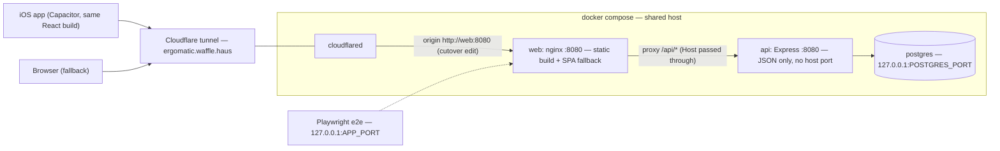

# Frontend/API Container Split + Native-First Policy — Design

Approved 2026-07-29. Mini-phase between the testing interlude and Phase 5.
Motivation (James): the iOS app is the primary surface; the API must not be
entangled with frontend serving; web/native divergence must stay structurally
capped. Investigation conclusion (recorded): keep the single React codebase —
the "web frontend" and the native app are the same code (11 files, 254 lines,
five `isNative()` call sites, all in auth/transport); dropping web would
destroy the Playwright/design/screenshot harness and the Vite dev loop to save
~12 lines of static serving. A Swift rewrite would double-maintain the
TypeScript domain layer. Decision: split serving into its own container
(nginx), adopt a native-first policy, enforce the platform seam with lint.

## Decisions

| Question | Decision |
|---|---|
| Topology | nginx in front: `web` container serves static + proxies `/api` to `api` container. Tunnel origin becomes the web container. Same-origin preserved (cookies, originCheck unchanged); local compose/e2e exercise the identical routing prod uses |
| Alternative rejected | Cloudflare tunnel path-routing — routing logic would live only in tunnel config, untestable locally |
| Express static serving | DELETED, not disabled: remove the `clientDir` block from `app.ts` (lines 73–84), `AppDeps.clientDir`, and the `clientDir` wiring in `index.ts:115`. The api image ships zero client assets |
| Images | ONE `app/Dockerfile`, multi-stage with two named targets: `api` (current runtime stage minus `dist/client`) and `web` (`nginx:1.29-alpine` + `dist/client` + nginx.conf). Client builds once in the shared `build` stage. **Verify nginx current stable tag before pinning (`docker run --rm nginx:...` / registry check) — do not trust 1.29 from memory** |
| Dev loop | Unchanged — `pnpm dev` (Vite :5173 proxying /api) never used clientDir |
| Timing | Own PR/deploy before Phase 5; screens land on the new topology |

## nginx config (`app/nginx.conf`)

- `listen 8080` (unprivileged; nginx alpine images run fine unprivileged on
  8080 — keeps the container-port convention and the compose `read_only` +
  `cap_drop: ALL` hardening pattern; use the `nginxinc/nginx-unprivileged`
  image if the stock image fights read-only root).
- `location /api/ { proxy_pass http://api:8080; }` with `proxy_set_header
  Host $host;` and `X-Forwarded-For`/`X-Forwarded-Proto` — Host passthrough
  is what keeps `originCheck` and cookie behavior byte-identical.
- `location / { try_files $uri /index.html; }` — replaces the Express SPA
  fallback regex.
- `location = /index.html { add_header Cache-Control "no-cache"; }`;
  hashed assets under `/assets/` get `Cache-Control "public, max-age=31536000,
  immutable"`.
- No body-size or websocket special-casing (none needed today); gzip on for
  text types.

## compose changes

- `app` service renamed `api` (container `ergomatic-api`): same build context
  with `target: api`, same env/hardening/healthcheck, **no ports mapping**
  (internal only — the API is no longer reachable from the host except
  through nginx).
- New `web` service (container `ergomatic-web`): `target: web`, same
  hardening pattern (no-new-privileges, cap_drop ALL, read_only + tmpfs as
  needed for nginx pid/cache), `depends_on: api: condition:
  service_healthy`, ports `"${APP_BIND:-127.0.0.1}:${APP_PORT:-8081}:8080"`
  (the existing APP_PORT contract moves to web — host `.env` keeps
  `APP_PORT=8082`, nothing for James to edit), healthcheck: fetch
  `http://localhost:8080/api/health` THROUGH the proxy — so `compose up
  --wait` (deploy.sh's gate) now proves nginx→api→postgres end-to-end.
- `cloudflared` `depends_on` moves to `web`.
- `compose.e2e.yml`: `TEST_AUTH_SECRET` override targets the renamed `api`
  service; nothing else changes. Playwright baseURL stays
  `http://127.0.0.1:8081` and now lands on nginx.
- `APP_VERSION` build arg: api target only (unchanged semantics;
  `/api/health.version` remains the single version surface).
- **Shared-host port rule (binding): every host-facing port is an env var
  with a documented default — no hardcoded host ports anywhere in compose
  files.** After the split the full host-port surface is exactly two vars:
  `APP_PORT` (web, default 8081; prod host `.env` = 8082 because natalie
  owns 8080/8081) + `APP_BIND` (default 127.0.0.1), and `POSTGRES_PORT`
  (default 5433). The api service maps NO host port by design (reachable
  only through nginx); container-internal ports (8080, 5432) are
  network-namespaced per compose project and cannot conflict with other
  apps on the host. `.env.example` documents all three vars with the
  shared-host context. Exit criterion: `grep -n '"[0-9]' compose*.yml`
  shows no host-side port literal outside a `${VAR:-default}` expansion.

## Tunnel cutover (deploy-time, one-time)

Host tunnel config origin: `http://app:8080` → `http://web:8080`. James (or a
walkthrough) edits it once, same drill as Phase 1 activation. **Decision:
accept a brief cutover window** — merge → deploy replaces `app` with
`api`+`web` → the tunnel 502s for the minutes until the origin edit. No
dual-running transition machinery (YAGNI — household app). Rollback story:
revert the tunnel origin AND redeploy the previous SHA (the old
single-container `app` image still serves static).

## Native-first policy (the enforcement half)

- ESLint `no-restricted-imports` (client project scope): importing
  `@capacitor/*` or `./platform` / `../platform` etc. is an error outside an
  adapter allowlist, initially exactly `app/src/platform.ts` and
  `app/src/api.ts` (implemented as an eslint `files`/`ignores` override —
  the rule applies to `app/src/**` except the allowlist). `You.tsx` and
  `SignIn.tsx` currently call `isNative()` directly: part of this phase is
  moving those two behaviors behind adapter functions (e.g. `signOut()` in
  an auth adapter, a `SignInButton` decision exported from an adapter) so
  the allowlist stays transport-only files, screens import adapters. Zero
  violations at merge.
- CLAUDE.md Rules addition (one bullet): native-first design priority; the
  web build is the test harness + fallback surface — never dropped, never
  polished at the app's expense; platform conditionals live only in adapter
  modules (lint-enforced).
- ROADMAP note under standing rules: revisit serving topology only if web
  and API release cadences diverge; record the 2026-07-29 investigation
  outcome in one line.

## Also in scope

- Verify `app/ios/` resolves Capacitor via Swift Package Manager, not
  Cocoapods (Cocoapods library updates end 2026-12-02). If on Cocoapods,
  file the migration as a follow-on in ROADMAP (not this PR) unless it is a
  one-line project setting.

## Out of scope

Screens (Phase 5), auth changes, API surface changes, PM5, any dual-serving
transition machinery, Android.

## Testing & exit criteria

- `docker` CI job builds BOTH targets; `e2e` job (flows + design + the
  existing 11 tests) green against the nginx-fronted stack — this is the
  structural proof of the split.
- Playwright flows implicitly cover: SPA fallback via nginx (deep-link
  reload), `/api` proxying (sign-in backdoor + data calls), no-cache
  index.html header (assert in design.spec or a new structural test —
  cheap header assertion).
- Unit/client suites: `app.test.ts` static-serving tests deleted with the
  feature; api container serves 404 for non-API paths (test updated to pin
  that).
- Lint: restricted-import rule active, zero violations, and a negative
  fixture proving it fires (per TESTING.md's tests-with-teeth stance, the
  proof lives in the lint config being exercised by the existing
  `pnpm lint` gate on a deliberate violation during development, recorded
  in the task report — no committed always-failing fixture).
- Deployed: tunnel cut over, prod `/` (SPA via nginx), `/api/health`
  (proxied), and a deep-link path all 200 through
  `https://ergomatic.waffle.haus`; `POST /api/auth/test-signin` still
  absent (401-unauthenticated fall-through signature).
- Release recommendation posted (expected: not needed — serving topology
  only, no client/native change).

## Topology diagram

